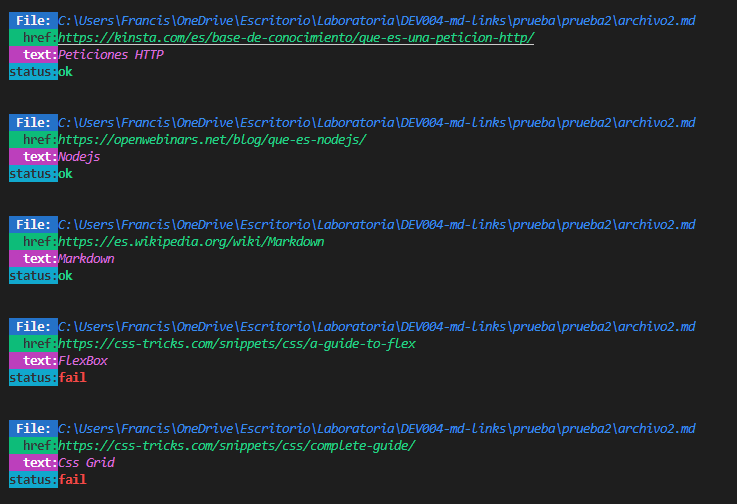
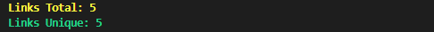
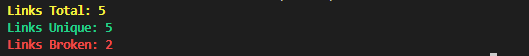

# 1. Resumen del proyecto
 Creacion de una herramienta de liena de comando CLI asi como una librerua en Javascriot, que lea y analice archivos en formato Mardown, verificando los links que contesngan y generar estadisticas de los mismos.

## 2. Planeacion de Sprints

<b>1er Sprint</b> 
Lectura y analisis del README de mdLink, asi como la investigacion para realizar los diagramas de flujo

<b>2do Sprint</b> 
- Creacion del diagrama de flujo API
- Creacion del diagrama de flujo CLI

<b>3er Sprint</b> 
Investigacion del modulo fyle system y entenderlo lo cual me llevo a realizar las siguientes funciones en en archivo api.js
- Existe la ruta?
- Ruta absoluta
- Convertir ruta relativa a absoluta
- Es directorio?
- Es archivocon extension .md?
- Leer archivos .md
- Peticion http

<b>4to Sprint</b> 
Investigacion que son funciones recursiva y tratar de entenderlas para aplicar. Por consiguiente logre aplicar la funcion recursiva en mi archivo index.js llamada (allReadDirectory)

<b>5to Sprint</b> 
Aplicar mis funciones que cree en el archivo api.js en mi funcion mdLinks que se encuentra en el archivo index.js. Fui armando esta funcion de acuerdo a como lo plantie en mi diagrama de flujo API

<b>6to Sprint</b> 

Instalaciones de:
- Babel
- Jest
- Chalk
- Inicio de realizar los test de las funciones de api.js

<b>7to Sprint</b> 

Aplicacion del ddiagrama de flujo CLI en mi archivo cli.js, donde realice los calculos de los totales de links unicos, totales de links y totales de links rotos junto con sus validaciones respectivas.

## 3. Diagrama de Flujos
Para la realizacion de este proyecto se procedio a realizar dos diagramas de flujos que se presentan a continuacion:

## 4. Modulos del Proyecto

<b>api.js</b> 
En este archivo se encuentran las funciones realizadas mediante los metodos de fyle system (fs) los cuales fueron aplicados para cada una de las funciones realizadas y que las mismas han sido llamadas en el archivo index.js en la funcion mdLinks, en este archivo se importan fs, path de node.js ademas tambien importamos fetch de fetch lo cual me permite hacer peticiones basado en promesas y lo cual me valida cada uno de los links. 

<b>index.js</b> 
Este archivo contiene 2 funciones:
- funcion recursiva (allReadDirectory): la cual tiene como funcionalidad leer los directorios y subdirtectorios de la ruta seleccionada. El mismo permite validar si un archivo es .md que me lo guarde en un array vacio y si no es un archivo.md preguntar si es un directorio y alli es donde se llama la funcion recursiva que llamar a la funcion allReadDirectory dentro de la misma. Esta funcion me retornara un array con archivos .md.

- funcion mdLink que retorna una promesa y la cual realiza las siguientes validaciones: 
  * leer cada archivo .md
  * buscar los links y extraerlos del archivo
  * hacer la peticion http y si validate es true

<b>cli.js</b> 
En este modulo se ejecutan las lineas de comando --validate, --stats y --validate --stats. Se importa la funcion mdLinks de index.js y tambien se importa chalk de chalk que es para darle color a la consola. Tambien se utiliza el process.argv el cual recibe las lineas de comando mencionadas anteriormente 

## 5. Modo de uso:
<b>Ejecución de comandos</b> 

- Comando pincipal

    md-links

-Para visualizar las opciones de comando se ejecuta:

    md-links --help

- Para visualizar los links y sus status (ok or fail) que se encuentran dentro de los archivos.md ejecuta el siguiente comando:

    md-links ruta del archivo --validate
  
Ejemplo: 

    md-links .prueba\archivo.md --validate
  

- Para visualizar las estadisticas de los links se ejecuta el siguiente comando:

    md-links ruta del archivo --stats

Ejemplo:

    md-links .prueba\archivo.md --stats
    

- Para visualizar las estadisticas y status de los links se ejecuta el siguiente comando:

    md-links ruta del archivo --validate --stats

Ejemplo:

    md-links .prueba\archivo.md --validate --stats

## 6. Pruebas Unitarias

Se realizaron los test de las funciones de api.js llegando casi a su totalidad de coverage.

